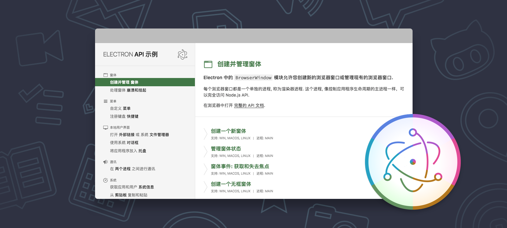

#  Electron API 演示(中文版)

[](https://travis-ci.org/electron/electron-api-demos)
[](http://standardjs.com)

> 此项目同步自 [electron](https://github.com/electron) 的 [electron-api-demos](https://github.com/electron/electron-api-demos) 项目. 除特殊情况, 将保持每两周一次的同步频率.
> 
> 更新日志请参阅: [CHANGELOG.md](CHANGELOG.md)

这是一个交互式的桌面应用程序, 通过示例代码演示了 [Electron](http://electron.atom.io) API 的核心特性. 当然, 它也是由 Electron 构建的. 此应用程序适用于 Windows, macOS 和 Linux 操作系统.

通过这个应用程序, 你可以了解用 Electron 能够做什么并使用源代码来学习如何创建一个基本的 Electron 应用程序.



---

此项目遵守“捐助者公约”[行为守则](CODE_OF_CONDUCT.md). 在参与过程中, 您需要遵守此守则. 如遇到不可接受的行为, 请向 electron@github.com 举报。

在 Twitter 上订阅 [@ElectronJS](https://twitter.com/electronjs) 来获取重要公告. 或访问 [electron website](http://electron.atom.io) 网站.

## 使用

你可以下载针对你当前系统的最新 [发行版本(英文)](https://github.com/electron/electron-api-demos/releases) 或是自己构建一个(具体看下面).

> 当前中文版本暂不提供打包发行版, 可以直接以开发模式启动或自行打包.

## 构建

在构建此应用之前, 你需要安装 [Node.js](https://nodejs.org).

```bash
$ git clone https://github.com/demopark/electron-api-demos-Zh_CN
$ cd electron-api-demos-Zh_CN
$ npm install
$ npm start
```

如果你不想通过克隆的方式, 你可以 [下载源码](https://github.com/demopark/electron-api-demos-Zh_CN/archive/master.zip).

为了便于开发, 你可以打开 DevTools 以全屏的方式运行程序:

```bash
$ npm run dev
```

## 扩展

通过 [阅读文档](docs.md) 来详细了解如何构建此应用或如何 [添加一个新演示](docs.md#添加一个章节或示例).